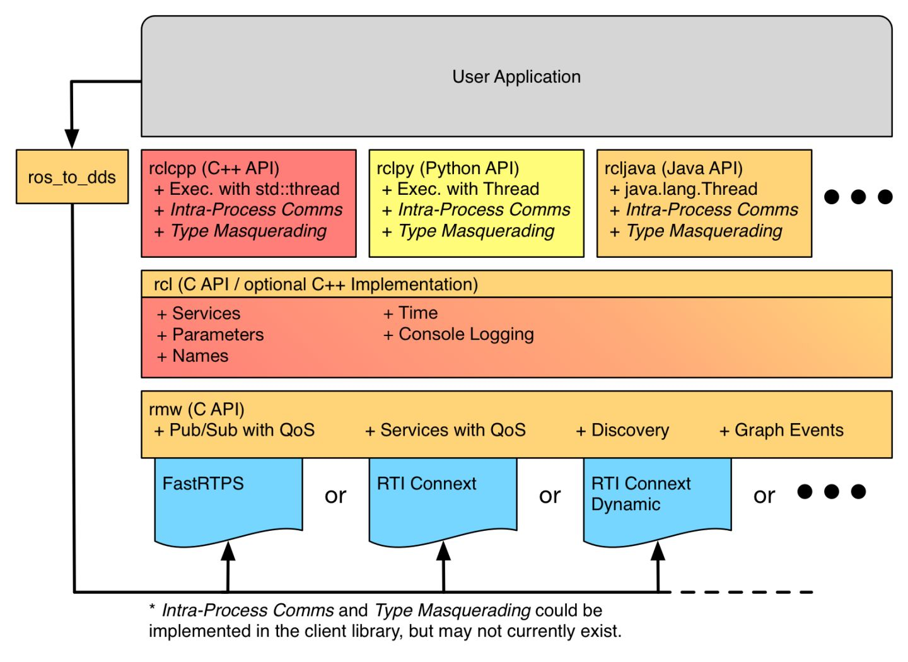

<!-- _class: title -->

# 有关于 ROS2 框架的简单介绍
 

刘逸珑
2022-07-18

---
# 目录
 
- 什么是 ROS2 
- ROS 几种应用层通讯方式
- ROS2 相较于 ROS1 的差异
- ROS2 中间件的框架（尚未完成）
- 可能的应用方向
- ROS1 移植调研
- ROS2 移植调研

---
# 什么是 ROS2

ROS 是⼀套相对完善的中间层、⼯具、软件乃⾄通⽤的接⼝和标准，帮助机器⼈⼯业领域的开发者能够快速开发系统原型并做测试和验证。
而 ROS2 是在此基础上对其部分的不足进行重构后的一个 ROS 系统。

<!-- 具体包括由引入 Master 节点带来的由于主节点丢失带来的程序错误，以及底层通过TCP和UDP协议等协议实现的通信所带来的延迟以及丢包，添加实时，Cerification, Safety, Security 性保证， lifecycle等 -->
---
<!-- header: None-->
# ROS2 应用层通讯方式

- Topic 
- Service
- Action

---
<!-- _class: tinytext -->
# 通讯方式：Topic

类似于信箱的消息传递机制

<!-- 
一种类似于信箱的节点间沟通关系
但是对于 ROS2 而言，其默认认为各个节点之间的信息都是即时传输的，不存在缓存的机制，（如果需要类似的机制的化需要根据DDS的规范引入对应的QoS策略来保证
-->

---
<!-- _class: tinytext -->
# 通信方式：Service

类似于 Client/Service 请求服务机制

<!-- 只存在一个服务器，可以同时为多个客户端提供服务 -->

---
<!-- _class: tinytext -->
# 通信方式： Action

一种加强版本的信息传递机制，在 C/S 架构上添加了反馈以及中断机制的实现。

---
<!-- header: http://wiki.ros.org/Master-->
# ROS2 相对于 ROS1 的差异

 

<!-- 
- 采用了基于 [DDS](https://www.dds-foundation.org/what-is-dds-3/) (Data Distribution Service) 标准实现的 [Discovery](https://community.rti.com/glossary/discovery)[自发现机制] 代替了原先的 Master，这也在底层同时提供了 DDS/RTPS 的支持以方便在不同的链接状况加进行支持。
- 提供了 intra-process API 方便同一进程中运行的节点间通过共享内存进行通信。 （executable table）
- 支持更多操作系统，提供实时性保障。
- 实现了统一的抽象接口，保证了各个组件的模块化以及可替换性
-->

---

# ROS2 中间件框架

<!--
按照我目前对于 rosrust 库的简单理解来看，client library 在 ROS1 的过程中实际上有点类似于基于下面的服务，对于抽象出来的各个 Concepts 进行实现，比如在 rosrust 库中就实现了一些基于 TCPROS/UDPROS 相关的内容，也因此，在实际操作过程中，可能会因为客户端库的不同，实现不同而存在性能的差异。（即语言与性能挂钩），在RCL的各种语言客户库实现下面添加多了一层以 C 语言实现的 RCL 服务库，保证了在各个语言中实现性能相同。 
在这层下面，为了方便不同DDS厂家接入他们对应的DDS系统（DDS, RTPS[一个基于UDP的尽力单播协议])，ROS2提供了一套同一的数据处理标准接口 RMW 对于各个 DDS 接入进行规范，只要厂商满足了这个接口规范，则其 DDS 可以被正常使用到 ROS2 中。
-->

---

# 可能的应用方向

- 将能在单个核心运行的 node 等组件化的链接成为一个二进制包，并且在核上运行。
- 对于需要对于核心行为进行 debug 的情况，提供可选的外部访问接口实现，方便操作人员使用他们电脑上的 rostopic, rosbag 等工具进行调试。

---
# ROS 1 移植调研

<!-- 
header: http://wiki.ros.org/Implementing%20Client%20Libraries 
_class: _hugetext
-->

- rosrust + ros-core-rs
- rosrust + roscpp

<!--
- 在初步调研的时候，以为ROS1的client和ROS2的差不多，主要是调用ROS框架提供的一些简单的API，我们还需要对于内部框架结构进行更进一步的分析，但是经过后面对于代码的阅读之后，发现其Client Library其实更加接近于一个基于软件抽象对于软件的大体实现，比如rosrust代码中涵盖与TCPROS/UDPROS相关的实现，以及 ROSXML-RPC 的实现等。
- 但是我观察到他的仓库中有关于 Master 等实现实际上是基于现有的 ROS 框架实现的，实际上没有脱离框架的范畴，具体表现在其内部定义的 ROSMaster 实际上不是 ROS1 Master 的完整实现，而是一个简单的抽象，其使用的 Master 还是依赖于 roscpp 提供的 ROS MASTER 实现的。
- 就此，我经过简单的调研之后认为我们可能存在两种方向，
    - 一种是在 rosrust 移植实现之后通过一些现有的库进行调用，通过自己实现 ROS Master 的方式绕过 roscpp 的实现（或者说在前期调研中暂时使用这种方法）ros-core-rs
    - 另外一种是通过过移植 roscpp ，争取在 arceOS 上实现类似于 ROS1_comm 最小分发包的效果。
    - 对于方法一而言，其主要的难点在于我们可能需要对于 ROS Master 进行理解，并且一定程度上的对于其进行修改来契合我们的目标，因为按照当前我对于 ros-core-rs 库的测试结果，其不算一个非常完美的 ROS Master 实现，在与现有 ROS1 框架之间的通信上存在一定的问题，可能都需要后期修复或者找个办法绕过去，否则无法实现前文所确定的我们的第二种方法（即在不提供开发环境的方式下，通过对外暴露可选择的网络接口，方便开发人员在实际开发过程中进行debug等操作）
    - 对于方法二而言，由于 ros 目前的整个安装流程都是基于 rosdep 进行的，我们可能需要对于这个工具包或者`nix-ros-overlay`分析依赖关系，根据源代码仓库中的源代码，通过修改目前默认的编译方式以适配我们的编译链。
-->

---
# ROS 2 移植调研
<!--
style: |
  .columns {
    display: grid;
    grid-template-columns: repeat(2, minmax(0, 1fr));
    gap: 1rem;
  }
_class: _tinytext
-->

<ul> 
    <b>Client Library:</b>
    <li><a href="https://github.com/ros2-rust/ros2_rust">ros2_rust</a></li>
    <li><a href="https://github.com/sequenceplanner/r2r">r2r</a></li>
    <li><a href="https://github.com/adnanademovic/rosrust">rosrust</a></li>
    <li><a href="https://github.com/rclrust/rclrust">rclrust</a></li>
    <li><a href="https://github.com/ros2/rclpy">rclpy</a></li>
    <li><a href="https://github.com/ros2/rclcpp">rclcpp</a></li>
</ul>

---

# ROS 2 移植调研
<!--
_class: _tinytext
header: 基于 <a href="https://blog.csdn.net/qq_16893195/article/details/113937167">RTPS</a> (RealTime Publish Subscribe) 传输协议
-->

<ul> 
    <b>Data Distribution Service:</b>
    <li><a href="https://github.com/eProsima/Fast-DDS">Fast DDS</a></li>
    <li><a >Connext DDS</a></li>
    <li><a href="https://github.com/eclipse-cyclonedds/cyclonedds">Cyclone DDS</a></li>
    <li><a >GurumDDS</a></li>
    <li><a href="https://github.com/jhelovuo/RustDDS">RustDDS</a></li>
</ul>

<!-- 
- 对于 arceos 而言，目前尚未对于rust DDS可能存在的依赖问题进行分析，同时简单的看了下，实际上这个实现并不是完美的DDS实现，在运行现有的设计的时候可能需要进行预测试 
- 目前简单收集了下目前 arceOS 提供的系统调用信息。
-->
---

<!-- 
header: None
_class: hugetext
-->

End

---

- 通过 [rclrust](https://github.com/rclrust/rclrust) 以 rust 语言实现能在现有的 DDS（比如说默认DDS）上运行的应用。
- 逐步在 arceos 上完成对于现存的各个 DDS 的依赖支持，比如说 [Rust DDS](https://github.com/jhelovuo/RustDDS)，最终尝试实现在 arceos 上运行 ROS2 的效果。

---
