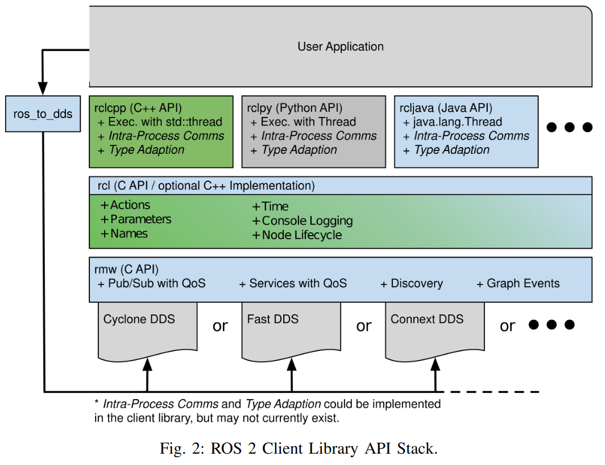

# ROS2 移植 ArceOS 可行性分析报告

根据[论文](https://arxiv.org/pdf/2211.07752.pdf)中配图，当前 ROS2 整体架构如下：

ROS2 在当前结构情况下如同上图所示，存在三层结构，即应用，中间件，操作系统层面。

在本次准备移植应用主要牵涉到三个部分的问题：

1. 使用什么方法编译客户端应用程序？

   1. 按照 ROS2 原版的设计我们是使用一个 [colcon](https://colcon.readthedocs.io/en/released/) 来实现编译效果，我们是否需要实现这个类似的功能？还是说我们提供 python 在 arceos 上的支持，亦或是重写，[从源编译](https://colcon.readthedocs.io/en/released/developer/bootstrap.html)？
   2. 还是说我们出于方便利用我们组件化OS特性的目的，在实际使用过程中针对与 Services 和 Client 不在同一个核心上的情况采用生成两个逻辑应用放在 hypervisor 上跟别人一起被调度的方法，因此只要实现一个能跑的应用就行，不需要跟着ros2的设计用 source 加载应用？
   3. 这个地方其实还牵涉到我们是否需要在 ArceOS 上提供一些帮助工具的问题*（ROS2 其实可以在不安装 topic 等命令行操作模块的情况下使用）*
   4. 这个地方其实还牵涉到了有关于 rcl 的实现问题上，目前 arceos 尚未存在 python 支持，对于上层而言

2. 我们要如何使 ROS2 能在我们的 arceos 上得到对应支持？

   1. 下载源码然后通过分析调用的头文件以及引用信息还有系统调用逐个实现？
   2. 这个地方可能需要通过对于[rosdep](https://github.com/ros-infrastructure/rosdep) python包的分析了解他具体是怎么调用cmake程序对于整个 ros2 程序进行编译的
   3. 通过参考 [nix-ros-overlay](https://github.com/lopsided98/nix-ros-overlay/blob/master/distros/humble/ros2cli/default.nix) 仓库中通过 nix 申明的依赖项目进行分析，并且尝试逆向实现？

3. 我们要如何提供 DDS 中间件的支持？

   1. 当前的几个可能性的选型： 
      被ROS2默认支持的：eProsima's Fast DDS, RTI's Connext DDS, Eclipse Cyclone DDS, and GurumNetworks GurumDDS
      尚未完全支持ROS2：RustDDS *（部分内容没有实现，且在尝试 ros2_client 调用的时候没有办法和现有 ROS2 进行联动[正在测试 ] ）*
   2. RustDDS还存在一些特性目前尚未得到支持，还需要进一步测试，目前打算尝试根据 [DDS规范测试](https://github.com/jhelovuo/dds-rtps) 提供的参考，获取其需要的系统调用名称，然后在 arceos 中实现对应操作。

   